### **Gambaran Arsitektur MVVM untuk Study Buddy**

Arsitektur **Microservices** memisahkan aplikasi menjadi beberapa layanan kecil yang mandiri dan saling berkomunikasi melalui API. Masing-masing layanan memiliki tanggung jawab tertentu, seperti **User Management**, **Group Management**, **Task Management**, **Reminder Service**, **Messaging Service**. Setiap layanan ini akan memiliki database sendiri, memisahkan pengelolaan data untuk memastikan skalabilitas yang lebih baik.

#### **Komponen Arsitektur Microservices untuk Study Buddy**

#### **1. Authentication and User Management Service**

- **Tanggung Jawab:** Mengelola autentikasi pengguna (login, logout, token) serta data profil pengguna.
- **API:** REST API untuk autentikasi, registrasi, dan manajemen profil.
- **Database:** PostgreSQL untuk penyimpanan data pengguna dan profil.
- **FCM:** Tidak menggunakan langsung.
- **Kafka:** Tidak menggunakan langsung.

#### **2. Group and Messaging Service**

- **Tanggung Jawab:** Mengelola grup belajar, anggota grup, dan komunikasi chat real-time antar anggota.
- **API:** REST API untuk manajemen grup dan pesan.
- **Database:** MongoDB (collection grup), Firebase Realtime Database untuk penyimpanan pesan chat.
- **FCM:** Tidak langsung, mengirim event ke Notification Service.
- **Kafka:** Mengirim event seperti `MessageSent` dan `GroupUpdated` ke message broker.

#### **3. Task and Reminder Service**

- **Tanggung Jawab:** Mengelola tugas belajar, pengingat, dan deadline yang terkait dengan pengguna dan grup.
- **API:** REST API untuk manajemen tugas dan pengingat.
- **Database:** MongoDB (collections tugas dan pengingat).
- **FCM:** Tidak langsung, mengirim event ke Notification Service.
- **Kafka:** Mengirim event seperti `TaskDue` dan `ReminderSet`.

#### **4. Content and Notes Management Service**

- **Tanggung Jawab:** Menyimpan dan mengelola materi belajar dan catatan yang dibagikan dalam grup.
- **API:** REST API untuk upload, edit, dan akses materi serta catatan.
- **Database:** Firebase S3 untuk penyimpanan konten dan catatan.
- **FCM:** Tidak langsung, mengirim event ke Notification Service.
- **Kafka:** Mengirim event seperti `ContentUpdated`.

#### **5. Schedule Service**

- **Tanggung Jawab:** Mengelola jadwal belajar dan pengingat terkait.
- **API:** REST API untuk manajemen jadwal.
- **Database:** MongoDB (collection jadwal).
- **FCM:** Tidak langsung, mengirim event ke Notification Service.
- **Kafka:** Mengirim event terkait jadwal.

#### **6. Notification Service**

- **Tanggung Jawab:** Menerima event dari microservices lain dan mengirimkan notifikasi push ke pengguna melalui FCM.
- **API:** REST API untuk manajemen notifikasi (misalnya preferensi pengguna).
- **Database:** Tidak memiliki database sendiri (opsional jika ingin menyimpan riwayat notifikasi).
- **FCM:** Langsung berinteraksi dengan Firebase Cloud Messaging.
- **Kafka:** Berlangganan ke berbagai event dari microservices lain.

```plantuml
@startuml

package "Study Buddy Microservices Architecture (Refined)" {

  actor "User" as user
  actor "Administrator" as admin

  node "API Gateway" {
    rectangle "Authentication Service API" as auth_service_api
    rectangle "Group and Messaging Service API" as group_messaging_service_api
    rectangle "Task and Reminder Service API" as task_reminder_service_api
    rectangle "Content and Notes Service API" as content_notes_service_api
    rectangle "Schedule Service API" as schedule_service_api
    rectangle "Notification Service API" as notification_service_api
  }

  node "Microservices" {
    rectangle "Authentication and User Management Service" as auth_service
    rectangle "Group and Messaging Service" as group_messaging_service
    rectangle "Task and Reminder Service" as task_reminder_service
    rectangle "Content and Notes Management Service" as content_notes_service
    rectangle "Schedule Service" as schedule_service
    rectangle "Notification Service" as notification_service
  }

  node "Database" {
    rectangle "User Database (PostgreSQL)" as user_db
    rectangle "Primary MongoDB (Groups, Tasks, Reminders, Schedule Collections)" as primary_mongo_db
    rectangle "Message Database (Firebase Realtime)" as message_db
    rectangle "Content and Note Storage (Firebase S3)" as content_notes_db
  }

  node "Event Broker" {
    rectangle "Message Broker (Kafka/RabbitMQ)" as message_broker
  }

  node "FCM" {
    rectangle "FCM (Firebase Cloud Messaging)" as fcm
  }

  user --> auth_service_api : Access User Data
  user --> group_messaging_service_api : Access Group Data & Chat
  user --> task_reminder_service_api : Access Task & Reminder Data
  user --> content_notes_service_api : Access Content & Notes
  user --> schedule_service_api : Access Schedule Data
  user --> notification_service_api : Receive Notifications

  auth_service_api --> auth_service : Authenticate User, Manage Profiles
  group_messaging_service_api --> group_messaging_service : Manage Groups & Messages
  task_reminder_service_api --> task_reminder_service : Manage Tasks & Reminders
  content_notes_service_api --> content_notes_service : Manage Materials & Notes
  schedule_service_api --> schedule_service : Manage Schedule
  notification_service_api --> notification_service : Send Notifications

  auth_service --> user_db : Store User Data & Profiles
  group_messaging_service --> primary_mongo_db : Store Group Data
  task_reminder_service --> primary_mongo_db : Store Task, Reminder Data
  schedule_service --> primary_mongo_db : Store Schedule Data
  group_messaging_service --> message_db : Store Messages
  content_notes_service --> content_notes_db : Store Content & Notes

  group_messaging_service --> message_broker : Publish Events (e.g., MessageSent, GroupUpdated)
  task_reminder_service --> message_broker : Publish Events (e.g., TaskDue, ReminderSet)
  content_notes_service --> message_broker : Publish Events (e.g., ContentUpdated)

  notification_service --> message_broker : Subscribe to Events
  notification_service --> fcm : Push Notifications

}

@enduml
```

### Penjelasan Diagram Arsitektur:

Tentu! Berikut penjelasan diagram arsitektur dengan gaya yang sama seperti contoh yang Anda berikan:

---

### Penjelasan Diagram Arsitektur:

1. **User** berinteraksi dengan aplikasi melalui berbagai tampilan (View) seperti **Dashboard**, **Group Chat**, **Task & Reminder**, **Content & Notes**, dan **Schedule**.
2. **View** mengirimkan permintaan data atau aksi ke **API Gateway**, yang akan meneruskan permintaan tersebut ke microservice terkait.
3. Setiap **Microservice** (seperti Authentication, Group and Messaging, Task and Reminder, Content and Notes, Schedule, Notification) menerima permintaan melalui API-nya, memproses logika bisnis, dan berinteraksi dengan database yang sesuai untuk menyimpan atau mengambil data.
4. Ketika ada perubahan data penting (misalnya pesan baru, tugas baru, pengingat aktif), microservice mengirimkan event ke **Message Broker** (Kafka/RabbitMQ) untuk memberitahu layanan lain, terutama **Notification Service**.
5. **Notification Service** menerima event dari message broker dan mengirimkan notifikasi push ke pengguna menggunakan **Firebase Cloud Messaging (FCM)**.
6. Data pesan chat disimpan secara real-time di **Firebase Realtime Database** untuk mendukung komunikasi langsung dan sinkronisasi cepat antar pengguna.
7. Database lain seperti **PostgreSQL** dan **MongoDB** menyimpan data pengguna, grup, tugas, jadwal, dan materi sesuai domain masing-masing.

### **Flow Penggunaan Microservices dalam Study Buddy:**

1. Pengguna melakukan autentikasi melalui Authentication Service.
2. Setelah berhasil, pengguna dapat mengakses fitur grup, chat, tugas, materi, dan jadwal melalui API Gateway.
3. Saat pengguna mengirim pesan atau memperbarui data (misalnya tugas atau materi), layanan terkait menyimpan data dan mengirim event ke message broker.
4. Notification Service menerima event ini, memprosesnya, dan mengirimkan notifikasi push ke pengguna yang relevan.
5. Semua interaksi chat real-time disimpan di Firebase Realtime Database untuk performa dan skalabilitas optimal.
6. Pengguna menerima notifikasi langsung melalui Firebase Cloud Messaging untuk pengingat dan update penting.

---

### **Keuntungan Menggunakan Microservices untuk Study Buddy**:

- **Modularitas dan Isolasi:** Setiap fitur utama dipisah dalam layanan terpisah, sehingga memudahkan pengembangan, pengujian, dan deployment secara independen.
- **Skalabilitas:** Layanan yang membutuhkan sumber daya lebih besar (misalnya messaging) dapat diskalakan secara terpisah tanpa mempengaruhi layanan lain.
- **Fleksibilitas Teknologi:** Menggunakan teknologi database yang paling cocok untuk masing-masing layanan (SQL, NoSQL, Firebase).
- **Resiliensi dan Isolasi Kesalahan:** Kerusakan pada satu layanan tidak langsung mempengaruhi layanan lainnya.
- **Kemudahan Pengembangan Tim:** Tim dapat fokus pada layanan spesifik tanpa terganggu oleh kode layanan lain.
- **Real-Time Communication dan Notifikasi Efisien:** Penggunaan Firebase dan message broker memungkinkan pengiriman pesan dan notifikasi yang cepat dan andal.
