## **Gambaran Arsitektur MVVM untuk Study Buddy**

Arsitektur **Microservices** memisahkan aplikasi menjadi beberapa layanan kecil yang mandiri dan saling berkomunikasi melalui API. Masing-masing layanan memiliki tanggung jawab tertentu, seperti **User Management**, **Group Management**, **Task Management**, **Reminder Service**, **Messaging Service**. Setiap layanan ini akan memiliki database sendiri, memisahkan pengelolaan data untuk memastikan skalabilitas yang lebih baik.

## **Komponen Arsitektur Microservices untuk Study Buddy**

### 1. Authentication and User Management Service

- **Tanggung Jawab:** Mengelola autentikasi pengguna (login, logout, token) serta data profil pengguna.
- **API:** REST API untuk autentikasi, registrasi, dan manajemen profil.
- **Database:** PostgreSQL untuk penyimpanan data pengguna dan profil.
- **FCM:** Tidak menggunakan langsung.
- **Kafka:** Tidak menggunakan langsung.

### 2. Group and Messaging Service

- **Tanggung Jawab:** Mengelola grup belajar, anggota grup, dan komunikasi chat real-time antar anggota.
- **API:** REST API untuk manajemen grup dan pesan.
- **Database:** MongoDB (collection grup), Firebase Realtime Database untuk penyimpanan pesan chat.
- **FCM:** Tidak langsung, mengirim event ke Notification Service.
- **Kafka:** Mengirim event seperti `MessageSent` dan `GroupUpdated` ke message broker.

### 3. Task Management Service

- **Tanggung Jawab:** Mengelola tugas belajar, pengingat, deadline, dan jadwal yang terkait dengan pengguna dan grup.
- **API:** REST API untuk manajemen tugas, pengingat, dan jadwal.
- **Database:** MongoDB (collections tugas, pengingat, dan jadwal).
- **FCM:** Tidak langsung, mengirim event ke Notification Service.
- **Kafka:** Mengirim event seperti `TaskDue`, `ReminderSet`, dan event terkait jadwal.

### 4. Content and Notes Management Service

- **Tanggung Jawab:** Menyimpan dan mengelola materi belajar dan catatan yang dibagikan dalam grup.
- **API:** REST API untuk upload, edit, dan akses materi serta catatan.
- **Database:** Firebase S3 untuk penyimpanan konten dan catatan.
- **FCM:** Tidak langsung, mengirim event ke Notification Service.
- **Kafka:** Mengirim event seperti `ContentUpdated`.

### 5. Notification Service

- **Tanggung Jawab:** Menerima event dari microservices lain dan mengirimkan notifikasi push ke pengguna melalui FCM.
- **API:** REST API untuk manajemen notifikasi (misalnya preferensi pengguna).
- **Database:** Opsional untuk menyimpan riwayat notifikasi.
- **FCM:** Langsung berinteraksi dengan Firebase Cloud Messaging.
- **Kafka:** Berlangganan ke berbagai event dari microservices lain.

```plantuml
@startuml

package "Study Buddy Microservices Architecture (Refined)" {

  actor "User" as user
  actor "Administrator" as admin

  node "API Gateway" {
    rectangle "Authentication Service API" as auth_service_api
    rectangle "Group and Messaging Service API" as group_messaging_service_api
    rectangle "Task Management Service API" as task_management_service_api
    rectangle "Content and Notes Service API" as content_notes_service_api
    rectangle "Notification Service API" as notification_service_api
  }

  node "Microservices" {
    rectangle "Authentication and User Management Service" as auth_service
    rectangle "Group and Messaging Service" as group_messaging_service
    rectangle "Task Management Service" as task_management_service
    rectangle "Content and Notes Management Service" as content_notes_service
    rectangle "Notification Service" as notification_service
  }

  node "Database" {
    rectangle "User Database (PostgreSQL)" as user_db
    rectangle "Primary MongoDB (Groups, Tasks, Reminders, Schedule Collections)" as primary_mongo_db
    rectangle "Message Database (Firebase Realtime)" as message_db
    rectangle "Content and Note Storage (Firebase S3)" as content_notes_db
  }

  node "Event Broker" {
    rectangle "Message Broker (Kafka/RabbitMQ)" as message_broker
  }

  node "FCM" {
    rectangle "FCM (Firebase Cloud Messaging)" as fcm
  }

  user --> auth_service_api : Access User Data
  user --> group_messaging_service_api : Access Group Data & Chat
  user --> task_management_service_api : Access Task, Reminder & Schedule Data
  user --> content_notes_service_api : Access Content & Notes
  user --> notification_service_api : Receive Notifications

  auth_service_api --> auth_service : Authenticate User, Manage Profiles
  group_messaging_service_api --> group_messaging_service : Manage Groups & Messages
  task_management_service_api --> task_management_service : Manage Tasks, Reminders & Schedule
  content_notes_service_api --> content_notes_service : Manage Materials & Notes
  notification_service_api --> notification_service : Send Notifications

  auth_service --> user_db : Store User Data & Profiles
  group_messaging_service --> primary_mongo_db : Store Group Data
  task_management_service --> primary_mongo_db : Store Task, Reminder, Schedule Data
  group_messaging_service --> message_db : Store Messages
  content_notes_service --> content_notes_db : Store Content & Notes

  group_messaging_service --> message_broker : Publish Events (e.g., MessageSent, GroupUpdated)
  task_management_service --> message_broker : Publish Events (e.g., TaskDue, ReminderSet, ScheduleUpdated)
  content_notes_service --> message_broker : Publish Events (e.g., ContentUpdated)

  notification_service --> message_broker : Subscribe to Events
  notification_service --> fcm : Push Notifications

}

@enduml
```

---

## Penjelasan Diagram Arsitektur

1. **User** berinteraksi dengan aplikasi melalui berbagai fitur seperti autentikasi, grup belajar, chat real-time, pengelolaan tugas & jadwal, materi & catatan, serta notifikasi.
2. **API Gateway** menjadi pintu masuk tunggal yang meneruskan permintaan ke microservices terkait.
3. Setiap **Microservice** mengelola domain tertentu, berinteraksi dengan database khusus yang sesuai kebutuhan.
4. Microservices mengirim event ke **Message Broker (Kafka/RabbitMQ)** untuk menginformasikan perubahan penting ke layanan lain, terutama ke **Notification Service**.
5. **Notification Service** berlangganan event tersebut dan mengirimkan notifikasi push via **Firebase Cloud Messaging (FCM)**.
6. Pesan chat disimpan secara real-time di **Firebase Realtime Database** untuk mendukung komunikasi cepat dan skalabilitas.
7. Database seperti **PostgreSQL** dan **MongoDB** menyimpan data pengguna, grup, tugas, dan jadwal sesuai domain masing-masing.

---

## Alur Penggunaan Microservices di Study Buddy

1. Pengguna melakukan autentikasi melalui Authentication Service.
2. Setelah berhasil, pengguna mengakses fitur grup, chat, tugas, materi, dan jadwal melalui API Gateway.
3. Saat pengguna mengirim pesan, menambah tugas, mengatur jadwal, atau memperbarui materi, layanan terkait menyimpan data dan menerbitkan event ke message broker.
4. Notification Service menerima event dan mengirim notifikasi push ke pengguna terkait.
5. Semua interaksi chat real-time disimpan di Firebase Realtime Database untuk performa optimal.
6. Pengguna menerima notifikasi langsung melalui Firebase Cloud Messaging.

---

## Keuntungan Menggunakan Microservices untuk Study Buddy

- **Modularitas dan Isolasi:** Layanan dipisah sesuai domain, memudahkan pengembangan dan deployment independen.
- **Skalabilitas:** Layanan dengan kebutuhan sumber daya berbeda dapat diskalakan secara terpisah.
- **Fleksibilitas Teknologi:** Memilih database dan teknologi yang paling sesuai untuk tiap layanan.
- **Resiliensi:** Kerusakan satu layanan tidak langsung mempengaruhi layanan lain.
- **Pengembangan Tim Lebih Mudah:** Tim bisa fokus pada layanan spesifik tanpa gangguan.
- **Real-Time dan Notifikasi Efisien:** Penggunaan Firebase dan event-driven architecture mendukung komunikasi cepat dan andal.
