### **Gambaran Arsitektur MVVM untuk Study Buddy**

Arsitektur **MVVM** memisahkan aplikasi menjadi tiga bagian utama:

- **Model**: Menyimpan data dan logika bisnis.
- **View**: Menangani tampilan antarmuka pengguna dan interaksi.
- **ViewModel**: Menghubungkan Model dan View. Menyediakan data untuk View dan mengelola logika yang terkait dengan interaksi pengguna.

#### **Komponen Arsitektur MVVM untuk Study Buddy**

1. **Model (Data dan Logika Bisnis)**

   - **User**: Menyimpan data pengguna seperti akun, nama, dan status login. Data selalu disimpan dan diambil dari cloud (Firebase Firestore/Realtime DB).
   - **Group**: Menyimpan data grup belajar termasuk nama grup, anggota, tugas, dan materi yang disimpan di cloud secara realtime.
   - **Task**: Data tugas seperti nama, tenggat waktu, dan status tersimpan di cloud, real-time terupdate antar perangkat.
   - **Reminder**: Pengingat tugas, ujian, dan kegiatan lainnya yang dikelola secara cloud realtime dan notifikasi.
   - **Schedule**: Data jadwal kuliah dan ujian disimpan cloud untuk update langsung ke user lain bila perlu.
   - **Material**: Materi kuliah seperti PDF, video, catatan disimpan di cloud storage (misal Firebase Storage).
   - **Notification**: Model pengaturan notifikasi dan pengiriman trigger notifikasi ke FCM via backend.
   - **Note**: Catatan kuliah yang dibuat dan disimpan di cloud, realtime sinkron ke semua device pengguna.
   - **Message**: Model pesan dalam Group Chat yang disimpan di Firebase Realtime Database dengan sinkronisasi realtime.

   **Penyimpanan Data**:

   - **Cloud Database**: Semua model berinteraksi langsung dengan cloud database seperti **Firebase Firestore** atau **Firebase Realtime Database** untuk data realtime dan sinkronisasi antar perangkat.
   - **Firebase Cloud Messaging (FCM)**: Digunakan untuk pengiriman notifikasi push real-time terkait pengingat tugas, jadwal, dan pesan grup.

---

2. **View (Antarmuka Pengguna)**

   - **Dashboard**: Menampilkan ringkasan aktivitas terbaru, pengingat tugas, dan jadwal terkini.
   - **Group Management**: Tampilan untuk mengelola grup belajar, melihat anggota, dan tugas grup.
   - **Task & Reminder**: UI untuk menambahkan, mengedit, dan memantau tugas serta pengingat.
   - **Materials Hub**: Antarmuka untuk upload dan akses materi kuliah seperti PDF, video, dan catatan.
   - **Schedule**: Kalender interaktif untuk menampilkan jadwal kuliah, ujian, dan pengingat penting.
   - **Intelligent Note-Taking**: UI untuk membuat, mengedit, dan menyimpan catatan kuliah secara realtime.
   - **Group Chat**: Tampilan chat grup dengan pesan realtime, termasuk kirim, terima, dan status baca pesan.

   **Teknologi**:

   - **Android**: Menggunakan **Jetpack Compose** atau **XML Layouts** untuk UI deklaratif dan responsif.
   - **iOS**: Menggunakan **SwiftUI** untuk UI deklaratif dan data-driven.
   - Semua UI berlangganan data realtime via ViewModel, memanfaatkan observer seperti LiveData/StateFlow (Android) atau Combine (iOS).

---

3. **ViewModel (Logika yang Menghubungkan Model dan View)**

   - **UserViewModel**: Mengelola autentikasi, profil pengguna, dan pengaturan akun. Menyediakan data user ke View serta meng-handle update profil.
   - **GroupViewModel**: Mengelola data grup belajar, termasuk penambahan anggota, pembuatan grup, dan update tugas grup. Menghubungkan realtime group data ke UI.
   - **TaskViewModel**: Mengatur tugas pengguna, pembuatan tugas baru, dan pembaruan status tugas secara realtime.
   - **ReminderViewModel**: Mengelola pengingat tugas dan pengaturan notifikasi terkait.
   - **ScheduleViewModel**: Mengelola jadwal kuliah dan ujian, mendeteksi bentrok jadwal dan update realtime.
   - **MaterialViewModel**: Mengelola upload dan pengelolaan materi kuliah di cloud storage.
   - **NoteViewModel**: Mengelola catatan kuliah pengguna, penyimpanan, dan sinkronisasi realtime.
   - **GroupChatViewModel**: Mengelola pengambilan dan pengiriman pesan grup, termasuk pembaruan status pesan secara realtime.
   - **NotificationViewModel**: Mengelola interaksi dengan backend notification service untuk mengirim trigger notifikasi dan mengatur preferensi notifikasi pengguna.

   **Tugas ViewModel**:

   - Menghubungkan **Model** dengan **View** secara asinkron dan realtime.
   - Mengelola **state** dan **logika presentasi** agar View hanya fokus pada rendering UI.
   - Menyediakan data reaktif menggunakan **LiveData**, **StateFlow**, atau **Combine** untuk memastikan View otomatis update saat data berubah.
   - Menangani pemanggilan backend (misal API notification) untuk notifikasi atau operasi lain yang tidak dilakukan secara langsung pada cloud database.

### **Diagram Arsitektur MVVM untuk Study Buddy**

```plantuml
@startuml

package "Study Buddy MVVM Architecture (Cloud-Only)" {

   actor "User" as user

   node "View (UI)" {
      rectangle "DashboardView" as dashboard
      rectangle "GroupView" as group_view
      rectangle "TaskView" as task_view
      rectangle "MaterialsView" as material_view
      rectangle "ScheduleView" as schedule_view
      rectangle "NoteView" as note_view
      rectangle "GroupChatView" as group_chat_view
      rectangle "ReminderView" as reminder_view
   }

   node "ViewModel" {
      rectangle "UserViewModel" as user_viewmodel
      rectangle "GroupViewModel" as group_viewmodel
      rectangle "TaskViewModel" as task_viewmodel
      rectangle "ReminderViewModel" as reminder_viewmodel
      rectangle "ScheduleViewModel" as schedule_viewmodel
      rectangle "MaterialViewModel" as material_viewmodel
      rectangle "NoteViewModel" as note_viewmodel
      rectangle "GroupChatViewModel" as group_chat_viewmodel
      rectangle "NotificationViewModel" as notification_viewmodel
   }

   node "Model (Cloud Data Layer)" {
      rectangle "UserModel (Firebase Firestore)" as user_model
      rectangle "GroupModel (Firebase Firestore)" as group_model
      rectangle "TaskModel (Firebase Firestore)" as task_model
      rectangle "ReminderModel (Firebase Firestore)" as reminder_model
      rectangle "ScheduleModel (Firebase Firestore)" as schedule_model
      rectangle "MaterialModel (Firebase Storage)" as material_model
      rectangle "NoteModel (Firebase Firestore)" as note_model
      rectangle "MessageModel (Firebase Realtime DB)" as message_model
   }

   node "Backend Notification Service" {
      rectangle "Notification Service API" as notif_service_api
   }

   node "FCM Service" {
      rectangle "Firebase Cloud Messaging" as fcm
   }

   user --> dashboard : Interacts with UI
   user --> group_view : Interacts with UI
   user --> task_view : Interacts with UI
   user --> material_view : Interacts with UI
   user --> schedule_view : Interacts with UI
   user --> note_view : Interacts with UI
   user --> group_chat_view : Interacts with Group Chat UI
      user --> reminder_view : Interacts with UI

   dashboard --> user_viewmodel : Request user data
   group_view --> group_viewmodel : Request group data
   task_view --> task_viewmodel : Request task data
   reminder_view --> reminder_viewmodel : Request reminder data
   schedule_view --> schedule_viewmodel : Request schedule data
   material_view --> material_viewmodel : Request material data
   note_view --> note_viewmodel : Request note data
   group_chat_view --> group_chat_viewmodel : Request chat data and send messages

   user_viewmodel --> user_model : Fetch/update cloud data
   group_viewmodel --> group_model : Fetch/update cloud data
   task_viewmodel --> task_model : Fetch/update cloud data
   reminder_viewmodel --> reminder_model : Fetch/update cloud data
   schedule_viewmodel --> schedule_model : Fetch/update cloud data
   material_viewmodel --> material_model : Upload/download cloud data
   note_viewmodel --> note_model : Fetch/update cloud data
   group_chat_viewmodel --> message_model : Fetch/send realtime chat data

   reminder_viewmodel --> notif_service_api : Request to send reminder notification
   group_chat_viewmodel --> notif_service_api : Request to send group chat notification

   notif_service_api --> fcm : Send push notifications

   }

@enduml
```

## Penjelasan Diagram Arsitektur

1. **User** berinteraksi dengan aplikasi melalui berbagai fitur seperti autentikasi, grup belajar, chat real-time, pengelolaan tugas & jadwal, materi & catatan, serta notifikasi.
2. **View** pada aplikasi (Android/iOS) mengakses data dan mengirim perintah melalui **ViewModel** yang mengelola logika bisnis dan state aplikasi.
3. **ViewModel** berkomunikasi langsung dengan **Model** yang mengakses data di **Firebase Firestore**, **Firebase Realtime Database**, dan **Firebase Storage** untuk data realtime dan sinkronisasi.
4. Untuk pengiriman notifikasi, **ViewModel** mengirim permintaan ke **Backend Notification Service** melalui API.
5. **Backend Notification Service** bertanggung jawab mengelola notifikasi dan mengirim push notification melalui **Firebase Cloud Messaging (FCM)** ke perangkat pengguna.
6. Pesan chat disimpan dan disinkronkan secara realtime di **Firebase Realtime Database** untuk komunikasi cepat antar pengguna.
7. Data seperti profil pengguna, grup, tugas, jadwal, materi, dan catatan disimpan dan diakses langsung dari **Firebase Firestore** dan **Firebase Storage** sesuai kebutuhan domain masing-masing.

---

## Alur Penggunaan Aplikasi Study Buddy (MVVM Cloud-Only)

1. Pengguna melakukan login dan autentikasi melalui UI yang terhubung ke **UserViewModel**.
2. Setelah login, pengguna mengakses fitur grup, chat, tugas, materi, dan jadwal melalui UI yang berkomunikasi dengan ViewModel terkait.
3. Saat pengguna mengirim pesan, membuat tugas, mengunggah materi, atau mengatur jadwal, ViewModel meng-update data secara realtime di cloud database.
4. Jika ada event yang memerlukan notifikasi, ViewModel memanggil Backend Notification Service untuk mengirim push notification.
5. Semua pesan chat disimpan dan disinkronkan realtime di Firebase Realtime Database untuk performa dan user experience optimal.
6. Pengguna menerima notifikasi push secara langsung melalui Firebase Cloud Messaging di perangkat mereka.

---

## Keuntungan Menggunakan Arsitektur MVVM dengan Cloud Realtime

1. **Modularitas dan Pemisahan Tanggung Jawab:** Memisahkan UI, logika aplikasi, dan data dengan jelas sehingga mudah dikembangkan dan diuji.
2. **Realtime Data Sync:** Firebase menyediakan sinkronisasi data realtime yang mulus antar perangkat tanpa perlu pengaturan backend rumit.
3. **Pengembangan Cepat dan Mudah:** Fokus pada pengembangan client-side dengan dukungan cloud storage dan messaging.
4. **Skalabilitas:** Firebase dan backend notifikasi menangani skalabilitas data dan pesan secara otomatis.
5. **Pengalaman Pengguna Lancar:** UI yang responsif dengan update data otomatis via LiveData/StateFlow/Combine.
6. **Pengelolaan Notifikasi Terpusat:** Backend Notification Service memudahkan kontrol dan pengiriman notifikasi secara terpusat dan aman.
