### **Gambaran Arsitektur MVVM untuk Study Buddy**

Arsitektur **MVVM** memisahkan aplikasi menjadi tiga bagian utama:

- **Model**: Menyimpan data dan logika bisnis.
- **View**: Menangani tampilan antarmuka pengguna dan interaksi.
- **ViewModel**: Menghubungkan Model dan View. Menyediakan data untuk View dan mengelola logika yang terkait dengan interaksi pengguna.

#### **Komponen Arsitektur MVVM untuk Study Buddy**

1. **Model (Data dan Logika Bisnis)**

   - **User**: Menyimpan data pengguna seperti akun, nama, jadwal, dan status login.
   - **Group**: Data grup belajar (nama grup, anggota, tugas, materi).
   - **Task**: Data tugas (nama tugas, tenggat waktu, status).
   - **Reminder**: Pengingat tugas, ujian, dan kegiatan lainnya.
   - **Schedule**: Data terkait dengan jadwal kuliah dan ujian.
   - **Material**: Data materi kuliah (file PDF, video, dan catatan).
   - **Notification**: Mengelola pengaturan dan pengiriman notifikasi (seperti pengingat tugas atau jadwal).
   - **Note**: Data catatan kuliah yang dibuat oleh pengguna.
   - **Message**: Model untuk menangani pesan dalam Group Chat (isi pesan, pengirim, waktu, status pembacaan).

   **Penyimpanan Data**:

   - **Local Database**: Menggunakan **Room Database** di Android untuk penyimpanan data lokal yang efisien, atau **CoreData** di iOS.
   - **Cloud Database**: **Firebase Firestore** atau **Firebase Realtime** Database untuk pengelolaan data secara real-time dan sinkronisasi pesan antar perangkat.'
   - **FCM (Firebase Cloud Messaging)**: Untuk pengiriman notifikasi waktu nyata, baik untuk pengingat tugas/ujian dan pesan grup.

2. **View (Antarmuka Pengguna)**

   - **Dashboard**: Menampilkan aktivitas terkini, pengingat tugas dab jadwal .
   - **Group Management**: Tampilan untuk grup belajar, percakapan grup, dan pengelolaan tugas grup.
   - **Task & Reminder**: Tampilan untuk menambahkan, mengelola tugas, dan pengingat.
   - **Materials Hub**: Tampilan untuk mengunggah dan melihat materi kuliah (PDF, gambar, video).
   - **Schedule**: Tampilan kalender untuk jadwal kuliah, ujian, dan pengingat.
   - **Intelligent Note-Taking**: Tampilan untuk membuat dan menyimpan catatan.
   - **Group Chat**: Tampilan untuk percakapan grup, mengirim pesan, dan melihat riwayat pesan.

   **Teknologi**:

   - **Android**: Menggunakan **Jetpack Compose** untuk UI deklaratif atau **XML Layouts**.
   - **iOS**: Menggunakan **SwiftUI** untuk UI deklaratif.

3. **ViewModel (Logika yang Menghubungkan Model dan View)**

   - **UserViewModel**: Mengelola data dan logika terkait dengan pengguna (login, pengaturan akun).
   - **GroupViewModel**: Mengelola logika untuk grup belajar (menambahkan anggota, mengelola grup, membuat grup).
   - **TaskViewModel**: Mengelola logika tugas, termasuk membuat tugas baru dan memperbarui status.
   - **ReminderViewModel**: Mengelola pengingat dan pengaturan notifikasi tugas.
   - **ScheduleViewModel**: Mengelola jadwal kuliah, ujian, dan deteksi bentrok jadwal.
   - **MaterialViewModel**: Mengelola pengunggahan dan pengelolaan materi kuliah.
   - **NoteViewModel**: Mengelola catatan kuliah dan metadata terkait.
   - **GroupChatViewModel**: Mengelola logika untuk pengambilan pesan grup, pengiriman pesan, dan pembaruan status pesan dalam Group Chat.
   - **NotificationViewModel**: Mengelola interaksi dengan backend notification service untuk mengirim trigger notifikasi.

   **Tugas ViewModel**:

   - Menghubungkan **Model** ke **View**.
   - Menangani **state** dan **logika presentasi** sehingga **View** hanya fokus pada menampilkan data.
   - Menyediakan **LiveData** / **StateFlow** di Android atau **Combine** di iOS untuk pembaruan data.
   - Memanggil backend untuk pengiriman notifikasi melalui NotificationViewModel.

### **Diagram Arsitektur MVVM untuk Study Buddy**

```plantuml
@startuml

package "Study Buddy MVVM Architecture without Microservices (Refined)" {

  actor "User" as user

  node "View (UI)" {
    rectangle "DashboardView" as dashboard
    rectangle "GroupView" as group_view
    rectangle "TaskView" as task_view
    rectangle "MaterialsView" as material_view
    rectangle "ScheduleView" as schedule_view
    rectangle "NoteView" as note_view
    rectangle "GroupChatView" as group_chat_view
  }

  node "ViewModel" {
    rectangle "UserViewModel" as user_viewmodel
    rectangle "GroupViewModel" as group_viewmodel
    rectangle "TaskViewModel" as task_viewmodel
    rectangle "ReminderViewModel" as reminder_viewmodel
    rectangle "ScheduleViewModel" as schedule_viewmodel
    rectangle "MaterialViewModel" as material_viewmodel
    rectangle "NoteViewModel" as note_viewmodel
    rectangle "GroupChatViewModel" as group_chat_viewmodel
    rectangle "NotificationViewModel" as notification_viewmodel
  }

  node "Model (Data Layer)" {
    rectangle "UserModel (Room/SQLite or CoreData)" as user_model
    rectangle "GroupModel (Room/SQLite or CoreData)" as group_model
    rectangle "TaskModel (Room/SQLite or CoreData)" as task_model
    rectangle "ReminderModel (Room/SQLite or CoreData)" as reminder_model
    rectangle "ScheduleModel (Room/SQLite or CoreData)" as schedule_model
    rectangle "MaterialModel (Room/SQLite or CoreData)" as material_model
    rectangle "NoteModel (Room/SQLite or CoreData)" as note_model
    rectangle "MessageModel (Firebase Realtime Database)" as message_model
  }

  node "Backend Notification Service" {
    rectangle "Notification Service API (Node.js/Express or similar)" as notif_service_api
  }

  node "FCM Service" {
    rectangle "Firebase Cloud Messaging" as fcm
  }

  user --> dashboard : Interacts with UI
  user --> group_view : Interacts with UI
  user --> task_view : Interacts with UI
  user --> material_view : Interacts with UI
  user --> schedule_view : Interacts with UI
  user --> note_view : Interacts with UI
  user --> group_chat_view : Interacts with Group Chat UI

  dashboard --> user_viewmodel : Request user data
  group_view --> group_viewmodel : Request group data
  task_view --> task_viewmodel : Request task data
  reminder_viewmodel --> reminder_viewmodel : Request reminder data
  schedule_view --> schedule_viewmodel : Request schedule data
  material_view --> material_viewmodel : Request material data
  note_view --> note_viewmodel : Request note data
  group_chat_view --> group_chat_viewmodel : Request chat data and send messages

  user_viewmodel --> user_model : Fetch or update user data
  group_viewmodel --> group_model : Fetch or update group data
  task_viewmodel --> task_model : Fetch or update task data
  reminder_viewmodel --> reminder_model : Fetch or update reminder data
  schedule_viewmodel --> schedule_model : Fetch or update schedule data
  material_viewmodel --> material_model : Fetch or update material data
  note_viewmodel --> note_model : Fetch or update note data
  group_chat_viewmodel --> message_model : Fetch or send chat messages

  reminder_viewmodel --> notif_service_api : Request to send reminder notification
  group_chat_viewmodel --> notif_service_api : Request to send group chat notification

  notif_service_api --> fcm : Send push notifications

}

@enduml
```

### Penjelasan Diagram Arsitektur:

1. **User** berinteraksi dengan berbagai tampilan (View) aplikasi seperti **Dashboard**, **Group Management**, **Task & Reminder**, dan lainnya.
2. **View** akan meminta data dari **ViewModel** (misalnya, mengirimkan permintaan untuk mengambil data tugas atau grup).
3. **ViewModel** bertanggung jawab untuk mengambil data dari **Model** (misalnya, mengambil data tugas dari **Task Model**), memprosesnya jika diperlukan, dan mengirimkannya kembali ke **View** untuk ditampilkan.
4. **Model** menyimpan data aplikasi (misalnya, informasi pengguna, tugas, grup, materi). Data ini disimpan di **Local Database** (**Room** di Android atau **CoreData** di iOS) untuk keperluan offline dan sinkronisasi, serta di **Firebase Realtime Database** untuk pesan chat real-time.
5. **Backend Notification Service** menerima permintaan notifikasi dari ViewModel dan meneruskan ke **Firebase Cloud Messaging (FCM)** untuk mengirim notifikasi push kepada pengguna.

### **Flow Penggunaan MVVM dalam Study Buddy:**

1. **User Interacts with View**:

   - Pengguna berinteraksi dengan tampilan (misalnya, membuka dashboard atau grup).

2. **ViewModel Retrieves Data**:

   - ViewModel mengelola logika untuk mengambil atau memanipulasi data dan memberikan pembaruan kepada View.

3. **Data Retrieved from Model**:

   - Model mengelola dan menyimpan data. Data ini bisa berasal dari penyimpanan lokal atau cloud.

4. **View Updates with New Data**:

   - Setelah ViewModel menerima data dari Model, ViewModel mengirimkan data ke View untuk ditampilkan.

5. **Notification Flow**:

   - Saat pengingat atau pesan grup baru perlu dikirim notifikasi, ViewModel mengirim permintaan ke backend notification service, yang kemudian mengirim push notification melalui FCM.

---

### Keuntungan Menggunakan **MVVM** dalam **Study Buddy**:

- **Pemisahan yang jelas** antara antarmuka pengguna (UI), logika presentasi, dan data.
- **Pengujian yang lebih mudah**: Anda bisa menguji ViewModel tanpa perlu khawatir tentang UI atau data.
- **Pemeliharaan yang lebih baik**: Karena setiap bagian memiliki tanggung jawab yang jelas, pengembangan fitur baru atau perbaikan bug akan lebih mudah.
- **Dukungan sinkronisasi data dan offline-first** dengan database lokal dan cloud.
- **Integrasi notifikasi real-time** yang aman dan terpusat melalui backend notification service.
